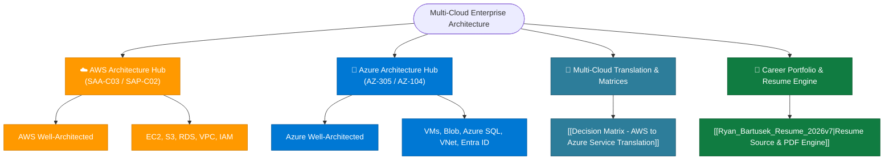

---
tags:
  - cloud/moc
  - multi-cloud
  - aws/moc
  - azure/moc
  - hub
last_updated: 2026-09-19
status: evergreen
---

# ☁️ Multi-Cloud Enterprise Architecture Knowledge Vault

> [!abstract] Enterprise Cloud Solutions Architect Hub
> A production-grade, interconnected Second Brain engineered for **Multi-Cloud Solutions Architecture**, covering deep domain mastery for both **Amazon Web Services (AWS)** and **Microsoft Azure**, paired with an automated headless browser resume & career portfolio engine.

---

## 🗺️ Master Cloud Navigation Hubs

---

## 🏛️ Cloud Architecture Portals

### ☁️ Amazon Web Services (AWS)
- 📌 **Master Hub**: **[[AWS Architecture Knowledge Hub]]**
- 📋 **Framework**: [[Well-Architected Framework MOC]]
- 💻 **Compute**: [[Compute MOC]] (EC2, Auto Scaling, Lambda, ECS, EKS, Fargate)
- 🗄️ **Storage**: [[Storage MOC]] (S3 Deep Dive, EBS, EFS, FSx, Storage Gateway)
- 🗃️ **Databases**: [[Databases MOC]] (RDS, Aurora, DynamoDB, ElastiCache, Redshift)
- 🌐 **Networking**: [[Networking MOC]] (VPC, Route 53, CloudFront, Transit Gateway)
- 🔐 **Security & IAM**: [[Security MOC]] (IAM, SCPs, KMS, Secrets Manager, GuardDuty)
- 📨 **Messaging**: [[Integration MOC]] (SQS, SNS Fan-Out, EventBridge, Step Functions)
- 📊 **Monitoring**: [[Monitoring MOC]] (CloudWatch, CloudTrail, Config, SSM)
- 🛡️ **Resilience**: [[High Availability & DR Strategies]] & [[RTO & RPO Comparison]]
- 🎯 **Exam Cheat Sheet**: [[SAA-C03 High-Yield Exam Cheat Sheet]]

### 🔷 Microsoft Azure
- 📌 **Master Hub**: **[[Azure Architecture Knowledge Hub]]**
- 📋 **Framework**: [[Azure Well-Architected Framework MOC]]
- 💻 **Compute**: [[Azure Compute MOC]] (Virtual Machines, VMSS, App Service, ACA, AKS, Functions)
- 🗄️ **Storage & Data**: [[Azure Storage & Data MOC]] (Blob Storage, ADLS Gen2, Files, Azure SQL, Cosmos DB)
- 🌐 **Networking**: [[Azure Networking MOC]] (VNets, Hub-and-Spoke, Virtual WAN, ExpressRoute, Front Door)
- 🔐 **Identity & Governance**: [[Identity & Governance MOC]] (Microsoft Entra ID, PIM, RBAC, Policy, Key Vault)
- 🛡️ **BCDR & Observability**: [[Azure BCDR & Monitoring MOC]] (ASR, Azure Backup, Monitor, Log Analytics, Migrate)
- 🎯 **Exam Cheat Sheet**: [[AZ-305 High-Yield Exam Cheat Sheet]]

---

## 🔄 Multi-Cloud Decision Matrices & Cross-References

| Matrix / Tool | Primary Purpose | Scope |
| :--- | :--- | :--- |
| **[[Decision Matrix - AWS to Azure Service Translation]]** | Side-by-side architectural translation between AWS and Azure services | Compute, Storage, Data, Network, IAM, Ops |
| **[[Decision Matrix - Database Selection]]** | Workload pattern to database engine mapping (Relational, Key-Value, Graph, In-Memory) | AWS & Multi-Cloud |
| **[[Decision Matrix - Storage Services]]** | Block vs Object vs File vs Hybrid Gateway decision criteria | AWS & Multi-Cloud |
| **[[Decision Matrix - Decoupling & Messaging]]** | Message queuing, pub/sub, event routers, and streaming pipelines | AWS & Multi-Cloud |
| **[[Decision Matrix - Hybrid Connectivity]]** | VPN vs Direct Connect / ExpressRoute vs Transit Gateway / Virtual WAN | AWS & Azure Hybrid |
| **[[RTO & RPO Comparison]]** | Disaster recovery tiers (Backup & Restore, Pilot Light, Warm Standby, Active-Active) | Multi-Cloud Resilience |

---

## 📄 Professional Career Portfolio & Resume Engine

- 📂 **Directory**: `resume/`
- 📝 **Current Source Version**: [[Ryan_Bartusek_Resume_2026v7|Ryan Bartusek Resume (2026v7)]]
- 🖨️ **Headless PDF Engine**: `python3 render_pdf.py` (generates ATS-optimized single-page vector PDF)
- 📖 **Documentation**: [[resume/README|Resume & Career Engine Runbook]]

---

## 🛠️ Vault Organization & Note Standards
1. **Repository Link Integrity**: All internal notes use standard Obsidian Wikilinks `[[Note Name]]` and resolve cleanly across `aws/`, `azure/`, and `resume/`.
2. **Templates**: Generate new architecture scenario notes using [[Template - Architecture Scenario]] or service breakdowns using [[Template - Service Deep Dive]].
3. **Inbox Processing**: Capture quick thoughts and exam questions in [[00 - Inbox/README|00 - Inbox/]].
