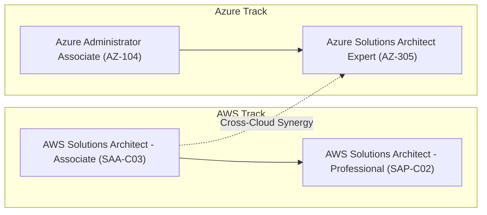

# ☁️ Multi-Cloud Enterprise Architecture & Solutions Knowledge Vault

[](https://aws.amazon.com/certification/)
[](https://learn.microsoft.com/en-us/credentials/certifications/azure-solutions-architect/)
[](https://obsidian.md)
[](https://mermaid.js.org/)
[](https://git-scm.com/)
[](#)

> A production-grade, interconnected Second Brain and active-recall repository engineered for **Multi-Cloud Enterprise Solutions Architecture**—spanning deep domain coverage across **Amazon Web Services (AWS)** (SAA-C03 / SAP-C02) and **Microsoft Azure** (AZ-305 / AZ-104), paired with an automated headless browser **resume & career portfolio pipeline**.

---

## 🎯 Purpose & Learning Strategy

Designing, implementing, and defending enterprise-scale cloud architectures across hyperscalers requires more than memorizing vendor marketing material. It requires:
1. **Multi-Cloud Trade-Off Analysis**: Evaluating Cost vs. Performance vs. Resiliency vs. Operational Overhead across AWS and Azure.
2. **Rosetta Stone Pattern Recognition**: Translating primitives and topologies between platforms (e.g. AWS Transit Gateway $\leftrightarrow$ Azure Virtual WAN, DynamoDB $\leftrightarrow$ Cosmos DB, IAM $\leftrightarrow$ Microsoft Entra ID).
3. **Keyword & Scenario Trigger Mapping**: Recognizing explicit and hidden requirements in architectural reviews and certification exams.
4. **Deep Conceptual Interlinking**: Understanding how storage, compute, networking, identity, and governance synthesize into resilient hybrid-cloud architectures.
5. **Career Execution & Portfolio Artifacts**: Transforming architectural mastery into ATS-optimized markdown sources and vector print PDFs via an automated headless browser pipeline.

---

## 🗺️ Vault Architecture & Directory Structure

```text
professional-technology/
├── .obsidian/                                  # Vault configuration (wikilinks, asset routing)
├── 00 - Home.md                                # Master Multi-Cloud Vault Landing Hub
├── 00 - Inbox/                                 # Staging ground for rapid study capture & exam clippings
│   └── README.md
├── aws/                                        # ☁️ Amazon Web Services Architecture Track
│   ├── 00 - AWS Architecture Hub.md           # AWS Domain Master Landing Page
│   ├── 01 - Well-Architected Framework/        # 6 Pillars, lenses, and design principles
│   ├── 02 - Compute/                           # EC2, Auto Scaling, Lambda, ECS, EKS, Fargate
│   ├── 03 - Storage/                           # S3 Deep Dive, EBS, EFS, FSx, Storage Gateway
│   ├── 04 - Databases/                         # RDS, Aurora, DynamoDB, ElastiCache, Redshift
│   ├── 05 - Networking & Content Delivery/     # VPC, Subnets, Route 53, CloudFront, Transit Gateway
│   ├── 06 - Security, Identity & Compliance/   # IAM, SCPs, KMS, Secrets Manager, GuardDuty
│   ├── 07 - Application Integration & Messaging/# SQS, SNS, EventBridge, Step Functions, Kinesis
│   ├── 08 - Monitoring & Governance/           # CloudWatch, CloudTrail, Config, Systems Manager
│   ├── 09 - Disaster Recovery & High Avail/    # RTO/RPO strategies, Multi-AZ vs Multi-Region
│   └── 10 - Decision Matrices & Cheat Sheets/  # High-yield exam cheat sheets & decision trees
├── azure/                                      # 🔷 Microsoft Azure Architecture Track
│   ├── 00 - Azure Architecture Hub.md          # Azure Domain Master Landing Page & Study Plan
│   ├── 01 - Well-Architected Framework/        # Azure WAF: Reliability, Security, Cost, Ops, Perf
│   ├── 02 - Identity, Governance & Security/   # Entra ID, PIM, RBAC, Azure Policy, Key Vault
│   ├── 03 - Compute & App Services/            # VMs, VMSS, App Service, Container Apps, AKS, Functions
│   ├── 04 - Storage & Data Services/           # Blob, ADLS Gen2, Files, NetApp, Azure SQL, Cosmos DB
│   ├── 05 - Networking & Hybrid Connectivity/  # VNets, Hub-Spoke, Virtual WAN, ExpressRoute, Front Door
│   ├── 06 - Business Continuity & Monitoring/  # ASR, Azure Backup, Azure Monitor, Log Analytics, Migrate
│   └── 07 - Decision Matrices & Cheat Sheets/  # AZ-305 Cheat Sheet & AWS-to-Azure Translation Matrix
├── 11 - Templates/                             # Cloud-agnostic and service-specific note templates
│   ├── Template - Service Deep Dive.md
│   └── Template - Architecture Scenario.md
├── resume/                                     # Career portfolio & automated PDF build pipeline
│   ├── Ryan_Bartusek_Resume_2026v7.md          # Current active resume source (Markdown)
│   ├── Ryan_Bartusek_Resume_2026v7.pdf         # Compiled vector PDF print output
│   ├── render_pdf.py                           # Headless Chromium Python engine
│   └── README.md                               # Portfolio runbook & build instructions
├── assets/                                     # Diagrams, visual graphics, media attachments
├── .gitignore                                  # Multi-machine Obsidian, cloud sync & security hygiene
├── AGENTS.md                                   # Autonomous agent operational standards & multi-cloud rules
├── CLAUDE.md                                   # Pair-programming directives
└── README.md                                   # Repository master index & Git documentation
```

---

## 📂 Domain Portals & Maps of Content

### ☁️ AWS Architecture Track (`aws/`)

| Domain | Map of Content | Core Services Covered |
| :--- | :--- | :--- |
| **Master Hub** | [00 - AWS Architecture Hub](aws/00%20-%20AWS%20Architecture%20Hub.md) | AWS navigation, mindmaps, scoring weight, and study blueprint |
| **01. Framework** | [Well-Architected Framework MOC](aws/01%20-%20Well-Architected%20Framework/Well-Architected%20Framework%20MOC.md) | 6 Pillars: Operational Excellence, Security, Reliability, Performance, Cost, Sustainability |
| **02. Compute** | [Compute MOC](aws/02%20-%20Compute/Compute%20MOC.md) | EC2, Auto Scaling, ALB/NLB, Lambda, ECS, EKS, Fargate, App Runner |
| **03. Storage** | [Storage MOC](aws/03%20-%20Storage/Storage%20MOC.md) | S3 Deep Dive, EBS, EFS, FSx (Lustre/Windows/ONTAP), Storage Gateway |
| **04. Databases** | [Databases MOC](aws/04%20-%20Databases/Databases%20MOC.md) | RDS Multi-AZ & Read Replicas, Aurora Global, DynamoDB, ElastiCache, Redshift |
| **05. Networking** | [Networking MOC](aws/05%20-%20Networking%20&%20Content%20Delivery/Networking%20MOC.md) | VPC, Subnets, NAT GW, Transit Gateway, Route 53, CloudFront, Direct Connect |
| **06. Security** | [Security MOC](aws/06%20-%20Security,%20Identity%20&%20Compliance/Security%20MOC.md) | IAM, Organizations, SCPs, KMS envelope encryption, Secrets Manager, GuardDuty |
| **07. Integration** | [Integration MOC](aws/07%20-%20Application%20Integration%20&%20Messaging/Integration%20MOC.md) | SQS (Standard/FIFO/DLQ), SNS Fan-out, EventBridge, Step Functions, Kinesis |
| **08. Governance** | [Monitoring MOC](aws/08%20-%20Monitoring%20&%20Governance/Monitoring%20MOC.md) | CloudWatch, CloudTrail, AWS Config, Systems Manager (SSM) |
| **09. Resilience** | [High Availability & DR Strategies](aws/09%20-%20Disaster%20Recovery%20&%20High%20Availability/High%20Availability%20&%20DR%20Strategies.md) | RTO/RPO calculation, Backup & Restore, Pilot Light, Warm Standby, Active-Active |
| **10. Cheat Sheets** | [Decision Matrices & Cheat Sheets](aws/10%20-%20Decision%20Matrices%20&%20Cheat%20Sheets/) | High-yield keyword matchers, exam distractor traps, and SAA-C03 cheat sheets |

### 🔷 Microsoft Azure Architecture Track (`azure/`)

| Domain | Map of Content | Core Services Covered |
| :--- | :--- | :--- |
| **Master Hub** | [00 - Azure Architecture Hub](azure/00%20-%20Azure%20Architecture%20Hub.md) | Azure navigation, mindmap, AZ-305 exam blueprint, phased study roadmap |
| **01. Framework** | [Azure Well-Architected Framework MOC](azure/01%20-%20Well-Architected%20Framework/Azure%20Well-Architected%20Framework%20MOC.md) | Reliability, Security, Cost Optimization, Operational Excellence, Performance Efficiency |
| **02. Governance** | [Identity & Governance MOC](azure/02%20-%20Identity,%20Governance%20&%20Security/Identity%20&%20Governance%20MOC.md) | Microsoft Entra ID, Hybrid Identity (PHS/PTA), PIM, Azure RBAC, Azure Policy, Key Vault |
| **03. Compute** | [Azure Compute MOC](azure/03%20-%20Compute%20&%20App%20Services/Azure%20Compute%20MOC.md) | Azure VMs, Scale Sets (VMSS), App Service & Slots, Container Apps (ACA), AKS, Functions |
| **04. Storage** | [Azure Storage & Data MOC](azure/04%20-%20Storage%20&%20Data%20Services/Azure%20Storage%20&%20Data%20MOC.md) | Blob Storage, ADLS Gen2, Azure Files, NetApp Files, Azure SQL (MI/Hyperscale), Cosmos DB |
| **05. Networking** | [Azure Networking MOC](azure/05%20-%20Networking%20&%20Hybrid%20Connectivity/Azure%20Networking%20MOC.md) | VNets, Subnets, NSGs, UDRs, Azure Firewall, App Gateway, Front Door, ExpressRoute, Private Link |
| **06. BCDR & Ops** | [Azure BCDR & Monitoring MOC](azure/06%20-%20Business%20Continuity,%20Monitoring%20&%20Migration/Azure%20BCDR%20&%20Monitoring%20MOC.md) | Azure Site Recovery (ASR), Azure Backup, Azure Monitor, Log Analytics (KQL), Azure Migrate |
| **07. Cheat Sheets** | [AZ-305 High-Yield Exam Cheat Sheet](azure/07%20-%20Decision%20Matrices%20&%20Cheat%20Sheets/AZ-305%20High-Yield%20Exam%20Cheat%20Sheet.md) | Rapid scenario triggers, traps, and [AWS to Azure Service Translation Matrix](azure/07%20-%20Decision%20Matrices%20&%20Cheat%20Sheets/Decision%20Matrix%20-%20AWS%20to%20Azure%20Service%20Translation.md) |

---

## 🔄 Multi-Cloud Rosetta Stone Decision Matrix

Located in `azure/07 - Decision Matrices & Cheat Sheets/`:
- **[Decision Matrix - AWS to Azure Service Translation](azure/07%20-%20Decision%20Matrices%20&%20Cheat%20Sheets/Decision%20Matrix%20-%20AWS%20to%20Azure%20Service%20Translation.md)**: Side-by-side service mapping comparing Compute, Storage, Database, Networking, Security, Governance, and Operations between AWS and Azure.

---

## 💎 Using This Vault in Obsidian

### 1. Opening the Vault
1. Launch [Obsidian](https://obsidian.md).
2. Click **Open folder as vault**.
3. Select this repository root directory (`professional-technology`).
4. Obsidian automatically handles Wikilinks (`[[Note Name]]`) across `aws/`, `azure/`, and `resume/`.

### 2. Recommended Community Plugins
- **[Dataview](https://github.com/blacksmithgu/obsidian-dataview)**: Query notes dynamically by YAML tags (`#aws/service`, `#azure/compute`).
- **[Obsidian Git](https://github.com/Vinzent03/obsidian-git)**: Automatic sync and version control backup.
- **[Omnisearch](https://github.com/scambier/obsidian-omnisearch)**: Instant indexed search across notes and PDFs.

---

## 🏆 Multi-Cloud Certification Roadmap


