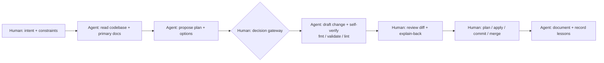

# 🤝 AI-Assisted Engineering Workflow

> [!abstract] Overview
> How I use AI coding agents (Claude Code, Gemini, Grok via Roo Code) for infrastructure and platform work **without giving up ownership of the result**. The agent researches, drafts, and verifies. I set intent, make architectural calls, review every diff, and run every state-changing command. The controls I put on my own coding agent are the same ones I'd put on a production AI agent — least privilege, human approval for mutations, verification against primary sources, and an audit trail.

---

## 1. 🧭 Operating Model

| Responsibility | Agent | Human |
| :--- | :---: | :---: |
| Reading the codebase and current vendor docs | ✅ | spot-check |
| Proposing designs and trade-offs | ✅ | **decides** |
| Drafting code, policies, docs | ✅ | reviews |
| Read-only diagnostics (`git status`, `terraform validate`, `kubectl get`) | ✅ autonomous | — |
| State changes (`terraform apply`, `kubectl apply`, IAM changes) | ❌ | ✅ |
| `git commit` / `push` / merge | ❌ | ✅ |
| Explaining *why* the change is safe | drafts | **must be able to answer unaided** |

---

## 2. 📐 Context Engineering

An agent is only as good as the context it starts with. I make the constraints explicit and version-controlled rather than re-typing them every session:

- **Layered instruction files** (`AGENTS.md`, imported by `CLAUDE.md`): one at the workspace root, one per repository. They encode invariants:
  - Never commit or push.
  - Treat every repo as public: no secrets, account IDs, WAN IPs, or local paths.
  - Declarative-only infrastructure.
  - Document as you build.
- **Domain playbooks** in the same files: naming conventions, repository ownership boundaries (which repo owns which cloud resource), and the CI/CD gate model.
- **Persistent memory**: durable preferences and project state carry across sessions. Examples: "notes are generic study guides", or "upgrade paused at step 2 of 10".
- **Primary sources over model memory**: model knowledge has a cutoff and cloud services change monthly. Anything version- or date-sensitive (service status, pricing, IAM action names, provider versions) is verified against vendor documentation before it's relied on, and notes record the verification date.

---

## 3. 🚦 Calibrated Autonomy

| Tier | Examples | Agent behaviour |
| :--- | :--- | :--- |
| **1 — Autonomous** | Reading files, `grep`, `git status`, `terraform fmt -check`, `terraform validate`, doc lookups | Just do it; keep momentum |
| **2 — Checkpoint** | IAM policy changes, `terraform apply`, `kubectl apply/delete`, cross-repo refactors, architectural choices | Explain the plan, the blast radius, and failure modes, then **stop** for a human decision |
| **Never** | Commit / push, writing secrets into files, disabling a guardrail to make something pass | Refuse or escalate |

The aim is fewer, better approvals. Approval fatigue is a security risk in itself, because rubber-stamping trains you to stop reading.

---

## 4. ✅ Verification Discipline

"The agent said it works" is not evidence. Every change gets checked at the layer where it can actually fail:

| Layer | Check |
| :--- | :--- |
| Syntax / style | `terraform fmt -check`, linters |
| Configuration validity | `terraform validate` (run in a scratch copy so provider binaries don't land in the cloud-synced vault) |
| Behaviour before mutation | PR-gated speculative `terraform plan` from a read-only CI role |
| IAM correctness | IAM Access Analyzer `validate-policy`; `simulate-principal-policy` for the *deny* paths (escalation attempts must fail) |
| Facts | Vendor docs and API references, with dates recorded in the note |
| Understanding | **Explain-back**: before approving, I answer "why is this safe?" and "what breaks if we remove X?" without the agent |

---

## 5. 🔐 Security of AI Use Itself

- **No secrets in context**: credentials stay in gitignored files and short-lived sessions (`aws login`, OIDC), never pasted into prompts.
- **Expired session = hard stop**: when cloud credentials have expired, the agent falls back to public documentation rather than asking for long-lived keys.
- **The agent can't publish**: no commit or push rights by policy; CI tokens are read-only; branch protection applies to admins too.
- **Leak audit before staging**: the agent inspects untracked files for keys, account IDs, PII, and local paths before suggesting `git add`.
- **Bounded blast radius**: CI roles that the agent's code runs under are capped by **permissions boundaries**, so even a bad (or malicious) change cannot escalate to administrator.

---

## 6. 🔁 Same Controls, Two Kinds of Agent

The controls on a coding agent map directly onto the controls for a production LLM agent (for example on Bedrock AgentCore):

| Risk | My coding agent | Production AI agent |
| :--- | :--- | :--- |
| **Excessive agency** | Tiered autonomy; no commit/apply rights | Least-privilege tool scopes (Gateway), return-of-control for state changes |
| **Privilege escalation** | Permissions boundary on CI-created roles; scoped `iam:PassRole` | Agent acts *on behalf of* the user (Identity), not as a super-role |
| **Hallucination / stale facts** | Verify against primary docs; date-stamped notes | RAG with citations; contextual grounding checks |
| **Prompt injection** | Treat fetched web/file content as data, not instructions | Prompt-attack guardrail; sanitize retrieved content |
| **Data leakage** | Public-by-default repo rules; leak audit | PII guardrails; deny data-plane reads to non-runtime roles |
| **Auditability** | Git history, PR plans, CloudTrail | Invocation logging, traces, CloudTrail |

---

## 7. 📓 Case Log — Lessons from Real Sessions

| Date | What happened | Lesson |
| :--- | :--- | :--- |
| 2026-10-06 | Before designing a Bedrock deployment, the agent read the existing IAM bootstrap and found that the CI apply role had **no `iam:PassRole`**, and that the workload permissions boundary allowed only one unrelated service. | Read the existing guardrails *first*. The blocker was in a different repo from the one being changed. |
| 2026-10-06 | Checking primary docs overturned three of the agent's initial assumptions: Bedrock Agents had moved to **maintenance mode** (successor: AgentCore); S3 Vectors Knowledge Base support needed AWS provider **≥ 6.27.0**; Bedrock **API keys** were a new long-lived credential type to govern. | Model memory goes stale. Verify anything date-sensitive, and say so when a plan changes. |
| 2026-10-06 | Auditing the AWS-managed `ReadOnlyAccess` policy (v190) showed it now grants **data-plane reads**: `s3vectors:GetVectors` / `QueryVectors`, and AgentCore memory records. The PR plan role would have been able to read embedded documents. An explicit Deny was added. | AWS-managed policies drift as new services launch. Re-audit "read-only" whenever a new data store is adopted. |
| 2026-10-06 | The agent inserted a table row out of order in a hub note, noticed it in its own diff, and fixed it. | Have the agent review its own diff before handing it over; it catches cheap mistakes. |
| 2026-10-06 | A vault-wide `grep` over a cloud-synced drive hung past the timeout; the agent stopped it and re-ran a scoped search. `terraform validate` was run in a scratch directory to keep provider binaries out of sync. | Tooling has environment-specific failure modes. Scope operations to the environment. |
| 2026-10-06 | Notes were first drafted for too narrow an audience. The human redirected them to a neutral study-guide framing, and the agent saved that as a durable preference. | The human owns audience and intent; persistent memory stops the same correction being needed twice. |
| 2026-10-06 | While designing the Knowledge Base, the agent noticed that its own earlier plan (manage the source documents as `aws_s3_object` resources) conflicted with a guardrail it had verified an hour before: the PR plan role is denied object reads, so every future plan would fail on refresh. It switched to a CI `s3 sync`, rather than proposing to weaken the deny. | Re-check new designs against the controls already in place. When a design collides with a guardrail, change the design, not the guardrail. |
| 2026-10-06 | Before CI ran, the agent checked resource schemas against the *installed* provider (`terraform providers schema -json`) rather than its memory of the docs, and pre-empted a known CI gotcha: the `setup-terraform` wrapper corrupts `$(terraform output -raw …)`. | Ground code in the actual tool version in use. Fold known pipeline gotchas into the change itself, with a comment explaining why. |

---

## 8. ⚠️ Anti-Patterns I Avoid

- Accepting a diff I can't explain.
- Letting the agent "fix" a failing check by loosening the check (deleting a Deny, widening a wildcard, skipping a gate).
- Trusting recalled service facts, prices, or API names without a source.
- Long, unreviewed autonomous runs across multiple repositories.
- Using AI output as documentation without noting what was verified and when.

---

## 🔗 Related Notes
- [[Amazon Bedrock - Platform Engineering Deep Dive]]
- [[Bedrock Review Questions]]
- [[AWS IAM (Policies, Roles, Delegation)]]
