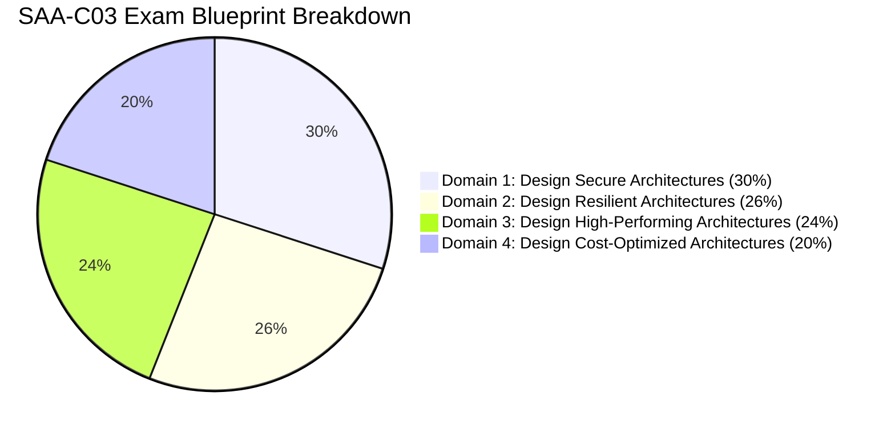

# ☁️ AWS Architecture Knowledge Hub

> [!abstract] AWS Architecture & Certification Domain
> Comprehensive active-recall study vault engineered for the **AWS Certified Solutions Architect – Associate (SAA-C03)** and **Professional (SAP-C02)** certifications, structured around the AWS Well-Architected Framework and production enterprise patterns.

---

## 🗺️ AWS Architecture Mindmap

```mermaid
mindmap
  root((AWS Architect))
    Foundations
      [[Well-Architected Framework MOC|Well-Architected]]
      [[High Availability & DR Strategies|Disaster Recovery]]
    Core Infrastructure
      [[Compute MOC|Compute]]
      [[Storage MOC|Storage]]
      [[Databases MOC|Databases]]
      [[Networking MOC|Networking & VPC]]
    Security & Governance
      [[Security MOC|Security & IAM]]
      [[Monitoring MOC|Monitoring & Governance]]
    Application Design
      [[Integration MOC|Messaging & Decoupling]]
    Exam Mastery
      [[SAA-C03 High-Yield Exam Cheat Sheet|Cheat Sheet]]
      [[Decision Matrix - Database Selection|Decision Matrices]]
```

---

## 📂 Domain Navigation & Maps of Content (MOCs)

| Domain | Map of Content | Key Architectural Services & Concepts |
| :--- | :--- | :--- |
| **01. Well-Architected** | [[Well-Architected Framework MOC]] | Operational Excellence, Security, Reliability, Performance, Cost Optimization, Sustainability |
| **02. Compute** | [[Compute MOC]] | EC2, Auto Scaling Groups, ALB/NLB, AWS Lambda, ECS, EKS, Fargate, App Runner |
| **03. Storage** | [[Storage MOC]] | S3 Deep Dive, S3 Lifecycle, EBS, EFS, FSx (Lustre/Windows/ONTAP), Storage Gateway |
| **04. Databases** | [[Databases MOC]] | RDS, Aurora Multi-AZ & Global, DynamoDB, ElastiCache (Redis/Memcached), MemoryDB, Redshift |
| **05. Networking** | [[Networking MOC]] | VPC, Subnets, IGW/NAT GW, Route 53, CloudFront, Direct Connect, Transit Gateway, PrivateLink |
| **06. Security & IAM** | [[Security MOC]] | IAM Policies/Roles, AWS Organizations, SCPs, KMS, Secrets Manager, GuardDuty, Macie |
| **07. Integration** | [[Integration MOC]] | SQS (FIFO/Standard/DLQ), SNS Fan-out, EventBridge, Step Functions, Kinesis Data Streams/Firehose |
| **08. Monitoring** | [[Monitoring MOC]] | CloudWatch Metrics/Logs/Alarms, CloudTrail, AWS Config Rules, Systems Manager (SSM) |
| **09. Resilience & DR** | [[High Availability & DR Strategies]] | RTO & RPO, Backup/Restore, Pilot Light, Warm Standby, Multi-Region Active-Active |
| **10. Cheat Sheets** | [[SAA-C03 High-Yield Exam Cheat Sheet]] | Rapid keyword pairings, service comparison matrices, anti-patterns & trap avoidance |

---

## ⚡ High-Yield Decision Matrices

- 📊 **[[Decision Matrix - Database Selection]]** $\rightarrow$ *Relational vs Document vs Key-Value vs In-Memory vs Graph*
- 🗄️ **[[Decision Matrix - Storage Services]]** $\rightarrow$ *Block (EBS) vs Object (S3) vs File (EFS/FSx) vs Hybrid Gateway*
- 📨 **[[Decision Matrix - Decoupling & Messaging]]** $\rightarrow$ *SQS vs SNS vs EventBridge vs Kinesis vs Step Functions*
- 🌐 **[[Decision Matrix - Hybrid Connectivity]]** $\rightarrow$ *IPsec VPN vs Direct Connect vs Transit Gateway vs PrivateLink*
- 🎯 **[[SAA-C03 High-Yield Exam Cheat Sheet]]** $\rightarrow$ *Instant scenario-to-service pairings & trap identification*
- ⏱️ **[[RTO & RPO Comparison]]** $\rightarrow$ *Disaster recovery trade-off tiers & cost curves*

---

## 🎯 Exam Scoring Focus (SAA-C03)



1. **Design Secure Architectures (30%)**:
   - [[AWS IAM (Policies, Roles, Delegation)]], [[Network Security (Security Groups, NACLs, WAF, Shield)]], [[KMS & Secrets Manager]], [[AWS Organizations & SCPs]].
2. **Design Resilient Architectures (26%)**:
   - [[EC2 Auto Scaling & Load Balancing]], [[High Availability & DR Strategies]], [[Amazon SQS (Standard, FIFO, DLQ)]], [[Amazon RDS & Aurora]].
3. **Design High-Performing Architectures (24%)**:
   - [[Amazon DynamoDB]], [[ElastiCache & MemoryDB]], [[CloudFront & Global Accelerator]], [[Amazon EFS & FSx]].
4. **Design Cost-Optimized Architectures (20%)**:
   - [[S3 Storage Classes & Lifecycle]], [[EC2 - Elastic Compute Cloud]], [[Cost Optimization Pillar]].

---

> [!tip] Multi-Cloud Cross Reference
> For architectural comparisons against Microsoft Azure, see [[Decision Matrix - AWS to Azure Service Translation]] and the [[Azure Architecture Knowledge Hub]].
