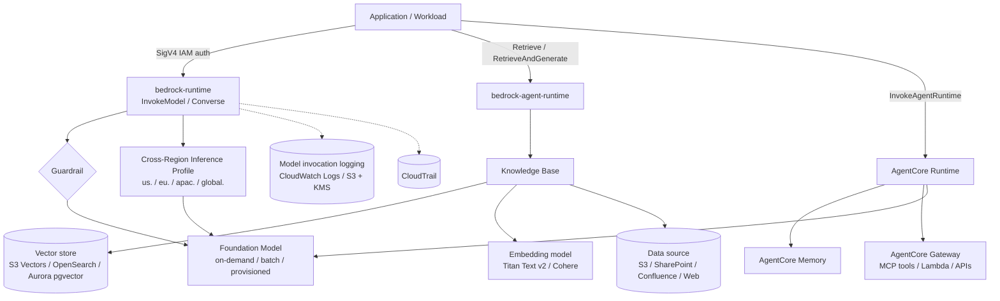
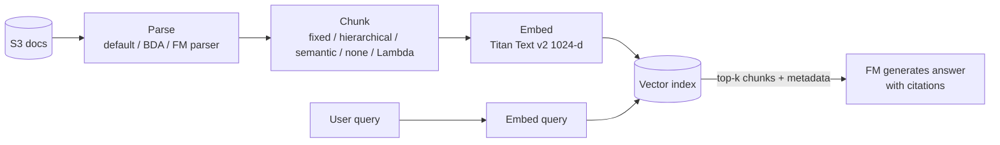

# 🧠 Amazon Bedrock — Platform Engineering Deep Dive

> [!abstract] Overview
> Amazon Bedrock is a **fully managed, serverless API** for foundation models (FMs) from Amazon (Nova, Titan) and third parties (Anthropic, Meta, Mistral, Cohere, and others). Nothing is "installed": the platform team's job is everything *around* the model call — **identity, network path, data protection, safety guardrails, observability, quotas, and cost allocation**. This note is framed from that platform-owner perspective, with controls for regulated and security-sensitive environments called out.

> [!info] Facts verified 2026-10-06
> Bedrock moves fast. Items marked 🔄 changed within the last year — re-verify against AWS docs before relying on them.

---

## 🗺️ Capability Map

---

## 1. 🔑 Model Access & Inference Options

### Model access 🔄
- **Serverless models are auto-enabled** in all commercial Regions (Oct 2025). The old "Model access" page where you clicked *Request access* per model is gone.
- On **first invocation of a third-party model**, Bedrock creates an AWS Marketplace subscription in the background (takes up to ~15 min).
- **Anthropic exception**: a one-time **use-case form** per account — or once at the **Organizations management account**, which then covers every member account. Submit it in the console playground or via the `PutUseCaseForModelAccess` API.
- **Governance consequence**: because access is now *on by default*, restricting models is **your job through IAM and SCPs** (see §5). Key takeaway: "auto-enablement moved model governance from a console toggle to policy-as-code."

### Inference modes & pricing levers

| Mode | Billing | When to use | Gotcha |
| :--- | :--- | :--- | :--- |
| **On-demand** | Per input/output token | Default; spiky or unpredictable traffic | Subject to per-model **TPM/RPM quotas** per Region |
| **Service tiers** 🔄 (Priority / Standard / Flex) | Premium / list / discounted per token | Priority for latency-critical traffic; Flex for tolerant workloads such as evals and summarization | Flex can be queued or slower |
| **Batch inference** | ~50% off on-demand | Bulk offline jobs: S3 JSONL in, S3 out | Asynchronous; job-based |
| **Provisioned Throughput** | Hourly per *model unit*, optional 1- or 6-month commitment | Guaranteed throughput; **required to serve custom (fine-tuned) models** | Expensive floor; pays even when idle |
| **Prompt caching** | Discounted cached-input tokens | Long repeated system prompts or RAG context | Model-specific support and TTL |

### Cross-Region Inference (CRIS)
- You invoke an **inference profile** instead of a model ID — e.g. `us.anthropic.claude-…` (geographic) or `global.…` (any commercial Region).
- Bedrock routes to a Region with capacity, which absorbs throttling. There is **no extra charge**; you pay the source-Region price.
- **Data residency**: *geographic* profiles keep processing inside that geography (US/EU/APAC). *Global* profiles may route anywhere. **Workloads with residency obligations use geographic profiles**, or pins to a single Region with an on-demand model ID where one is offered.
- ⚠️ **IAM gotcha**: the caller needs `bedrock:InvokeModel` on **both** the inference-profile ARN **and** the foundation-model ARNs in **every destination Region**. A Region-deny SCP (`aws:RequestedRegion`) must also allow those destination Regions, or calls fail with confusing AccessDenied errors.
- **Application inference profiles**: profiles you create and **tag**, wrapping a model or system profile, so you get **per-team or per-app cost allocation and chargeback** in Cost Explorer. This is the platform-team answer to "how do you show back GenAI cost to business units?"

---

## 2. 📚 Knowledge Bases (Managed RAG)

- **Ingestion** is an explicit `StartIngestionJob` (a "sync"). It is **incremental** — only changed or deleted source objects are reprocessed.
- **Two runtime APIs**:
  - `Retrieve` — returns chunks only; you build the prompt yourself (max control).
  - `RetrieveAndGenerate` — managed end-to-end RAG with **citations**, optional guardrail, and session context.
- **Retrieval tuning**: number of results, **metadata filtering** (sidecar `<file>.metadata.json`), **reranking** models, query decomposition, and **hybrid search** (semantic + keyword — OpenSearch / Aurora, *not* S3 Vectors).
- **Other KB types**: *structured* KB (natural language → SQL against Redshift or Glue catalog), and **GraphRAG** via Neptune Analytics.

### Vector store decision

| Store | Cost profile | Strengths | Weaknesses |
| :--- | :--- | :--- | :--- |
| **S3 Vectors** 🔄 | Pay per GB stored + per query; ~free idle | Cheapest; zero infrastructure; SSE-S3/SSE-KMS | Semantic search only (no hybrid); sub-second rather than ms latency; float32 only; metadata ≤ 1 KB / 35 keys per vector |
| **OpenSearch Serverless** | **OCU floor (hundreds of $/month) even idle** | Console quick-create default; hybrid search; binary vectors; ms latency | Idle cost; separate data-access + network + encryption policies |
| **Aurora PostgreSQL pgvector** | Instance/ACU-based | Fits Postgres shops; SQL + metadata in one place; hybrid search | You run a database: VPC, Secrets Manager, schema and indexes created up front |
| **Neptune Analytics** | m-NCU based | GraphRAG (entity relationships) | Niche |
| **Pinecone / Redis / MongoDB Atlas** | Third-party | Existing investment | **Data leaves AWS** — triggers third-party-risk review in regulated orgs |

> [!warning] S3 Vectors index gotchas
> - Index **dimension must match the embedding model** (Titan Text v2: 1024 / 512 / 256). It is immutable — changing it means rebuilding the index.
> - Declare `AMAZON_BEDROCK_TEXT` and `AMAZON_BEDROCK_METADATA` as **non-filterable metadata keys** when creating the index, or ingestion hits the per-vector filterable-metadata limit.
> - The encryption type on the vector bucket **cannot be changed after creation** — decide SSE-KMS (CMK) vs SSE-S3 on day one.
> - Hierarchical chunking with large parent chunks can exceed metadata size limits.

### KB service role (least privilege)
The KB assumes an IAM **service role** (trust `bedrock.amazonaws.com`, conditioned on `aws:SourceAccount` + `aws:SourceArn` to prevent confused-deputy attacks) that needs:
- `bedrock:InvokeModel` on the **embedding model** ARN only.
- `s3:GetObject` / `s3:ListBucket` on the docs bucket (+ `kms:Decrypt` if it uses a CMK).
- `s3vectors:PutVectors / GetVectors / QueryVectors / DeleteVectors` on the vector index.
- Whoever *creates* the KB needs **`iam:PassRole`** on that role, scoped with `iam:PassedToService = bedrock.amazonaws.com`.

---

## 3. 🛡️ Guardrails

Configurable safety policies evaluated on **input and/or output**:

| Policy | What it does | Example use |
| :--- | :--- | :--- |
| **Content filters** | Hate, insults, sexual, violence, misconduct — adjustable strength | Baseline for customer-facing chat |
| **Prompt attack filter** | Detects jailbreaks and prompt injection (input only) | Protects internal tools from injected instructions in retrieved docs |
| **Denied topics** | Natural-language topic definitions + examples | "Do not provide personalized investment advice" |
| **Word filters** | Exact-match block lists + managed profanity list (free) | Competitor names, internal codenames |
| **Sensitive information** | Built-in PII entities + **custom regex**; action **BLOCK** or **ANONYMIZE** (mask) | Mask account numbers, SSNs, card PANs in responses and logs |
| **Contextual grounding** | Scores response *grounding* (against the sources) and *relevance* (to the query); blocks below threshold | Reduce hallucinated policy answers in RAG |
| **Automated Reasoning checks** 🔄 | Validates answers against formal logic rules derived from a policy document | Eligibility or compliance rules that must be provably consistent |

- **Versioned** (`DRAFT` → immutable numbered versions). Production references a version, not `DRAFT` — the same discipline as Lambda versions/aliases.
- **`ApplyGuardrail` API**: evaluate text **without invoking a model**. You can apply Bedrock Guardrails to self-hosted or third-party models too — a "central safety layer" talking point.
- **Pricing**: per 1,000 *text units* (1 text unit ≤ 1,000 characters), charged **per policy type enabled**. Word filters are free.
- **Enforcement via IAM** 🔄: condition key **`bedrock:GuardrailIdentifier`** on `bedrock:InvokeModel`, `InvokeModelWithResponseStream`, `Converse`, … lets you **deny any invocation that doesn't carry the approved guardrail**. This turns guardrails from "app code should remember to pass it" into an **authorization-layer control** — and authorization-layer controls are what auditors want.

---

## 4. 🤖 Agents — Classic vs AgentCore 🔄

> [!important] Status change (June–July 2026)
> **Bedrock Agents was renamed "Bedrock Agents Classic" and placed in maintenance mode.** It is **closed to new customers** (after 2026-07-30); existing customers keep working, but its orchestration model catalog is frozen. **New builds use Amazon Bedrock AgentCore.** Know this one cold.

| | Bedrock Agents Classic | Bedrock AgentCore |
| :--- | :--- | :--- |
| Model | Declarative: instructions + action groups (OpenAPI/Lambda) + KBs; AWS-managed orchestration (ReAct-style) | Composable platform: **bring your own framework** (Strands, LangGraph, CrewAI, …) and **any model** |
| Runtime | Managed, opaque | **Runtime**: serverless, per-session microVM isolation, long-running sessions, A2A protocol |
| Tools | Action groups | **Gateway**: turns APIs and Lambda into **MCP** tools; connects to existing MCP servers; IAM + OAuth auth |
| State | Session attributes; limited memory | **Memory**: short-term + long-term strategies (facts, summaries, preferences) |
| Identity | Execution role | **Identity**: agent workload identities, OAuth token vault, act *on behalf of* a user |
| Other | Traces | **Observability** (OTel → CloudWatch), **Browser**, **Code Interpreter**, **Policy** |
| Terraform | `aws_bedrockagent_agent*` | `aws_bedrockagentcore_*` (runtime, gateway, gateway target, memory, workload identity, …) |

**Platform-team framing**: AgentCore Identity + Gateway is where security-sensitive orgs focus — *which identity does the agent act as, which tools can it reach, and is every tool call authorized and logged?*

---

## 5. 🔐 Security & Private Networking Controls (regulated-environment checklist)

### Data protection guarantees (memorize these)
- Prompts and completions are **not used to train** AWS or third-party models, and are **not shared with model providers**. Models run in AWS-operated *model deployment accounts* that the provider cannot access.
- **Encryption in transit** (TLS 1.2+) and at rest. **Customer-managed KMS keys** are supported for Knowledge Bases, Agents, Guardrails, custom-model artifacts, batch jobs, and invocation logs.
- Bedrock is **Regional**: your data stays in the Region you call, *except* when you opt into cross-Region inference (see §1).

### Identity layer
- **SigV4 IAM is the default.** All calls are authorized by IAM; Bedrock does **not** expose resource-based policies on foundation models, so control is identity-side plus SCPs.
- **Model allow-listing**: an SCP denying `bedrock:InvokeModel*` / `Converse*` unless the `Resource` matches approved model and inference-profile ARNs.
- **Guardrail enforcement**: `bedrock:GuardrailIdentifier` condition (see §3).
- **Bedrock API keys** 🔄 (Jul 2025): *short-term* keys (derived from a role session, expire with it) and *long-term* keys (an IAM-user **service-specific credential**). Security-sensitive orgs typically **deny them** org-wide:
  - SCP deny `iam:CreateServiceSpecificCredential` and `bedrock:CallWithBearerToken`, or
  - allow only short-term keys via `bedrock:BearerTokenType`, and cap age with `iam:ServiceSpecificCredentialAgeDays`.
  - ⚠️ With **long-term** keys, SCPs are evaluated against the **owning IAM user**, not the caller — a known bypass vector.

### Network layer (AWS PrivateLink)
Interface VPC endpoints, one per API plane:

| Endpoint service | API plane |
| :--- | :--- |
| `com.amazonaws.<region>.bedrock` | Control plane (model catalog, guardrails, logging config) |
| `com.amazonaws.<region>.bedrock-runtime` | `InvokeModel`, `Converse`, `ApplyGuardrail` |
| `com.amazonaws.<region>.bedrock-agent` | Build-time KB / Agent management |
| `com.amazonaws.<region>.bedrock-agent-runtime` | `Retrieve`, `RetrieveAndGenerate`, `InvokeAgent` |
| `com.amazonaws.<region>.bedrock-mantle` 🔄 | Bedrock Mantle API |
| `…bedrock-fips` / `…bedrock-runtime-fips` | FIPS 140 endpoints (us-east-1/2, us-west-2, ca-central-1, GovCloud) |

- **Endpoint policies** restrict *which principals and which models* can be reached through the endpoint.
- Pair with an IAM or SCP condition **`aws:SourceVpce`** (or `aws:SourceVpc`) to **deny Bedrock calls that don't traverse the approved endpoint**. That blocks exfiltration via a laptop with stolen credentials.
- **On-prem path**: Direct Connect / VPN → Route 53 Resolver inbound endpoint → private DNS for the interface endpoint. See [[Decision Matrix - Hybrid Connectivity]] and [[VPC Peering vs Transit Gateway vs PrivateLink]].
- Cost: each interface endpoint is billed hourly **per AZ** plus per GB. Five endpoints × three AZs adds up — a central shared-services VPC with endpoints shared over Transit Gateway is the usual enterprise pattern.

### Detect & audit
- **Model invocation logging is OFF by default.** Enable it per Region → CloudWatch Logs and/or S3 (full prompts and responses, optionally embeddings/images).
  - ⚠️ These logs **contain the sensitive data you are trying to protect**: CMK-encrypt them, lock down access, apply retention, and consider guardrail PII masking upstream.
- **CloudTrail** records API activity (who called what, which model) — the *who/when*, not the prompt content.
- **CloudWatch metrics**: invocations, latency, throttles, input/output token counts per model — the basis for quota and cost alarms.
- **AWS Config / Security Hub** controls for Bedrock (e.g. guardrails enforced, invocation logging enabled).

### Governance & compliance overlay
- **Model risk management / AI governance** (e.g. NIST AI RMF, ISO/IEC 42001, sector rules such as SR 11-7 in US financial services): an FM is a "model" — it needs an inventory, validation, ongoing monitoring, and documented limitations. Use **Bedrock model evaluation** (automatic + human / LLM-as-judge) as evidence.
- **Third-party risk**: model provider + AWS. Bedrock's "provider has no access to your data" architecture is the key mitigation.
- **Compliance scope**: confirm Bedrock's in-scope programs (SOC, ISO, PCI DSS, HIPAA eligibility, FedRAMP) in **AWS Artifact** / *AWS Services in Scope* — don't quote from memory.
- **Multi-account landing zone**: workload accounts consume Bedrock; a **security account** owns guardrail and logging standards; a **log-archive account** receives invocation logs. Govern with SCPs from the management account. See [[AWS Organizations & SCPs]].

---

## 6. 📈 Quotas, Resilience & Cost Operations

- Quotas are **per model, per Region, per account** (tokens per minute, requests per minute). Throttling (`ThrottlingException`) is the #1 production issue.
  - Mitigate with cross-Region inference profiles, exponential backoff with jitter, quota-increase requests, Provisioned Throughput for guaranteed capacity, and Priority tier for critical traffic.
- **Cost controls**: AWS Budgets + Cost Anomaly Detection; application inference profiles for chargeback; batch and Flex tiers for non-interactive work; prompt caching; route cheap tasks to small models (Nova Micro, Haiku-class).
- **Hidden-cost traps**: OpenSearch Serverless idle OCUs, Provisioned Throughput commitments, interface endpoints × AZs, invocation-log volume, guardrail text-unit charges on long RAG contexts.

---

## 🧪 Hands-on Lab Plan

The `infra-cloud-deployments` repository (GitHub OIDC → Terraform → AWS) hosts a Terraform-managed Bedrock demo built in these milestones:

1. **IAM prerequisites** (owned by the bootstrap stack in `personal-technology`): extend the workload permissions boundary for Bedrock service roles; grant the CI apply role Bedrock / S3 Vectors management actions and a scoped `iam:PassRole` (`iam:PassedToService = bedrock.amazonaws.com`).
2. **AWS provider upgrade** `~> 5.0` → `~> 6.x` (S3 Vectors + KB support landed in v6.27.0). Upgrade alone in its own PR with a no-op plan.
3. **Knowledge Base**: docs bucket + S3 vector bucket/index (1024-d, Titan Text v2) + KB service role + KB + S3 data source, over a synthetic "company policy handbook" corpus.
4. **Guardrail**: PII anonymization (account number regex, SSN), denied topic (investment advice), prompt-attack filter, contextual grounding — versioned.
5. **AgentCore** agent using the KB and guardrail (replaces Agents Classic).
6. **Observability & governance**: invocation logging (KMS), Budgets alarm, IAM guardrail enforcement.
7. **Private networking**: interface endpoints + endpoint policies + `aws:SourceVpce` — deploy, demonstrate, destroy.
8. *Stretch*: homelab Kubernetes workload calls Bedrock via **IAM Roles Anywhere** (X.509, no static keys).

---

## 🔗 Related Notes
- [[Generative AI MOC]]
- [[Bedrock Review Questions]]
- [[AWS IAM (Policies, Roles, Delegation)]] · [[AWS Organizations & SCPs]] · [[KMS & Secrets Manager]]
- [[VPC Peering vs Transit Gateway vs PrivateLink]] · [[Amazon CloudWatch & CloudTrail]]
- [[Specialized Databases (Redshift, Neptune, OpenSearch)]] · [[Amazon RDS & Aurora]]

## 📎 Sources (verified 2026-10-06)
- [Access Amazon Bedrock foundation models](https://docs.aws.amazon.com/bedrock/latest/userguide/model-access.html) · [Automatic enablement of serverless models (Oct 2025)](https://aws.amazon.com/about-aws/whats-new/2025/10/amazon-bedrock-automatic-enablement-serverless-foundation-models)
- [Bedrock Agents (Classic) — maintenance-mode notice](https://docs.aws.amazon.com/bedrock/latest/userguide/agents.html) · [AgentCore GA](https://aws.amazon.com/about-aws/whats-new/2025/10/amazon-bedrock-agentcore-available)
- [Vector store prerequisites (incl. S3 Vectors)](https://docs.aws.amazon.com/bedrock/latest/userguide/knowledge-base-setup.html)
- [Bedrock interface VPC endpoints](https://docs.aws.amazon.com/bedrock/latest/userguide/vpc-interface-endpoints.html)
- [Example SCPs for Amazon Bedrock](https://docs.aws.amazon.com/organizations/latest/userguide/orgs_manage_policies_scps_examples_bedrock.html) · [Securing Bedrock API keys](https://aws.amazon.com/blogs/security/securing-amazon-bedrock-api-keys-best-practices-for-implementation-and-management)
- [Terraform provider: S3 Vectors KB support (v6.27.0)](https://github.com/hashicorp/terraform-provider-aws/issues/44871)
- [Amazon Bedrock pricing](https://aws.amazon.com/bedrock/pricing/)
