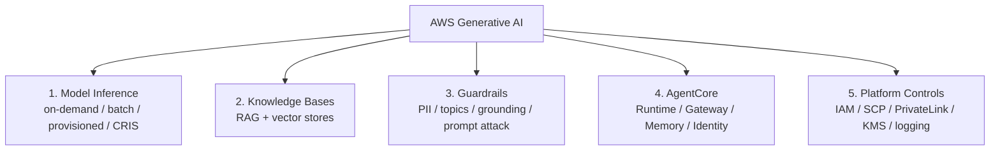

# 🧠 Generative AI & ML Map of Content

> [!abstract] Overview
> AWS generative AI from a **platform-engineering and security-governance** perspective. Amazon Bedrock provides managed foundation-model inference, retrieval (Knowledge Bases), safety (Guardrails), and agents (AgentCore). The platform team owns the identity, network, data-protection, observability, and cost controls around it.

---

## 🧭 Landscape

---

## 📂 Notes Directory

1. **[[Amazon Bedrock - Platform Engineering Deep Dive]]**:
   - Model access and pricing modes, cross-Region inference and data residency, Knowledge Bases and vector store selection, Guardrails, Agents Classic → AgentCore, PrivateLink and SCP controls, AI governance and model risk management.
2. **[[Bedrock Review Questions]]**:
   - 23 active-recall self-check questions with answers in the *mechanism → control → trade-off* shape.

---

## ⚡ High-Yield Comparison — Vector Stores for Bedrock KBs

| Store | Idle cost | Hybrid search | Best for |
| :--- | :--- | :--- | :--- |
| **S3 Vectors** | ~None | ❌ | Low-QPS internal RAG, labs, cost-sensitive |
| **OpenSearch Serverless** | OCU floor | ✅ | Enterprise default, low latency |
| **Aurora pgvector** | Instance/ACU | ✅ | Postgres-centric teams |
| **Neptune Analytics** | m-NCU | — | GraphRAG |

---

## 🔗 Related Notes
- [[00 - AWS Architecture Hub|AWS Architecture Hub]]
- [[Security MOC]] · [[Networking MOC]] · [[Databases MOC]]
