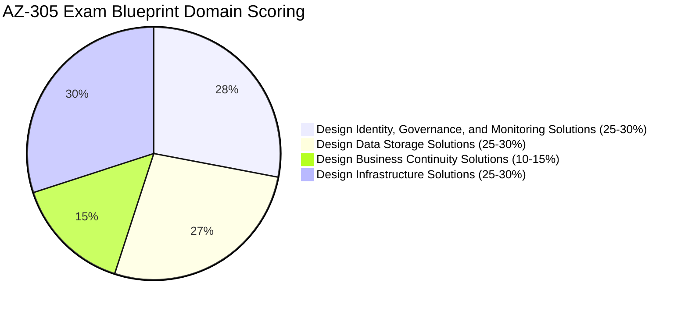
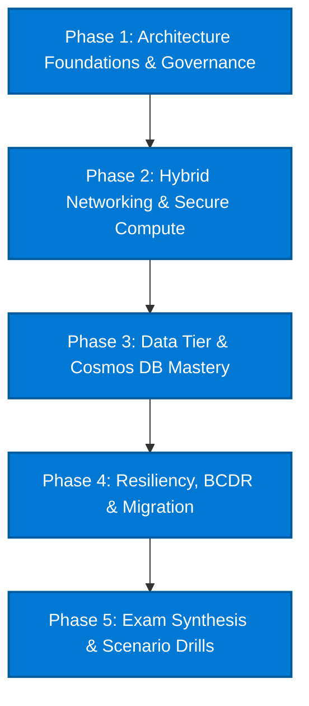

# 🔷 Azure Architecture Knowledge Hub & Learning Plan

> [!abstract] Microsoft Azure Solutions Architect Expert (AZ-305) Hub
> Engineered for mastering enterprise cloud architecture on Microsoft Azure, preparing for the **AZ-305: Designing Microsoft Azure Infrastructure Solutions** certification (with AZ-104 foundation), and mastering the **Microsoft Azure Well-Architected Framework**.

---

## 🗺️ Azure Architecture Mindmap

```mermaid
mindmap
  root((Azure Architect))
    Foundations
      [[Azure Well-Architected Framework MOC|Azure Well-Architected]]
      [[Identity & Governance MOC|Entra ID & Policy]]
    Core Infrastructure
      [[Azure Compute MOC|Compute & Containers]]
      [[Azure Storage & Data MOC|Storage & Databases]]
      [[Azure Networking MOC|Virtual Networks & Hybrid]]
    Operations & BCDR
      [[Azure BCDR & Monitoring MOC|Monitor, Backup & ASR]]
      [[Azure BCDR & Monitoring MOC|Migration Strategy]]
    Mastery & Cross-Cloud
      [[AZ-305 High-Yield Exam Cheat Sheet|AZ-305 Cheat Sheet]]
      [[Decision Matrix - AWS to Azure Service Translation|AWS vs Azure Matrix]]
```

---

## 🎯 AZ-305 Exam Blueprint & Weighting



| Domain | Weight | Core Focus Areas | Key Map of Content |
| :--- | :--- | :--- | :--- |
| **Domain 1: Identity, Governance & Monitoring** | 25–30% | Microsoft Entra ID, Hybrid Identity, Conditional Access, PIM, Subscriptions, Management Groups, Azure Policy, RBAC, Key Vault, Azure Monitor, Log Analytics | [[Identity & Governance MOC]] |
| **Domain 2: Data Storage Solutions** | 25–30% | Azure Blob (Hot/Cool/Cold/Archive, Immutability), Azure Data Lake Storage Gen2, Azure Files, NetApp Files, Azure SQL (DTU vs vCore, Hyperscale), Managed Instances, Cosmos DB consistency models & partitioning | [[Azure Storage & Data MOC]] |
| **Domain 3: Business Continuity Solutions** | 10–15% | High Availability architectures, Availability Sets vs Zones, Azure Backup, Azure Site Recovery (ASR) failover/failback, RTO/RPO SLAs, Cross-Region Replication (CRR) | [[Azure BCDR & Monitoring MOC]] |
| **Domain 4: Infrastructure Solutions** | 25–30% | Azure VMs, Scale Sets (VMSS), App Services, Container Apps, AKS, VNet architecture, Hub-and-Spoke, Virtual WAN, ExpressRoute, VPN Gateways, Azure Firewall, Application Gateway, Front Door, Private Endpoints | [[Azure Compute MOC]] & [[Azure Networking MOC]] |

---

## 📂 Domain Navigation & Maps of Content (MOCs)

| Directory / Domain | Map of Content | Core Services Covered |
| :--- | :--- | :--- |
| **01. Framework** | [[Azure Well-Architected Framework MOC]] | Reliability, Security, Cost Optimization, Operational Excellence, Performance Efficiency |
| **02. Governance & Identity** | [[Identity & Governance MOC]] | Microsoft Entra ID (Azure AD), Entra PIM, Azure RBAC, Azure Policy, Management Groups, Defender for Cloud |
| **03. Compute & Apps** | [[Azure Compute MOC]] | Azure VMs, VMSS, App Service (Linux/Windows), Azure Functions (Consumption/Premium), ACA, AKS |
| **04. Storage & Databases** | [[Azure Storage & Data MOC]] | Blob Storage, ADLS Gen2, Azure Files, NetApp Files, Azure SQL, SQL MI, Cosmos DB, Azure Database for PostgreSQL |
| **05. Networking & Hybrid** | [[Azure Networking MOC]] | VNets, Subnets, NSGs, ASGs, UDRs, Azure Firewall, App Gateway, Azure Front Door, ExpressRoute, Private Link |
| **06. BCDR & Monitoring** | [[Azure BCDR & Monitoring MOC]] | Azure Site Recovery (ASR), Azure Backup, Azure Monitor, Log Analytics, Application Insights, Azure Migrate |
| **07. Matrices & Cheat Sheets**| [[AZ-305 High-Yield Exam Cheat Sheet]] | Rapid keyword pairings, decision trees, trap avoidance, and [[Decision Matrix - AWS to Azure Service Translation]] |

---

## 🗓️ Structured Phased Study & Execution Roadmap



### Phase 1: Identity, Governance & Architecture Foundations
- Master the 5 pillars of the **Microsoft Azure Well-Architected Framework**.
- Design enterprise subscription topologies: Root Management Group $\rightarrow$ Landing Zones $\rightarrow$ Subscriptions $\rightarrow$ Resource Groups.
- Enforce compliance via **Azure Policy Initiatives** (e.g. allowed locations, SKU restrictions, tag enforcement) and **Azure RBAC** custom roles.
- Configure **Microsoft Entra Privileged Identity Management (PIM)**: Just-In-Time (JIT) access, approval workflows, and access reviews.

### Phase 2: Hybrid Networking, Edge & Secure Compute
- Architect Hub-and-Spoke vs **Azure Virtual WAN** topologies.
- Differentiate layer 4 vs layer 7 routing: **Azure Load Balancer** vs **Application Gateway** (WAF) vs **Azure Front Door** (Global Anycast).
- Enforce zero-trust ingress/egress via **Azure Firewall Premium** and **Private Endpoints (Private Link)**.
- Compute selection: VMs/VMSS vs App Service (Isolated v2) vs Azure Container Apps (ACA) vs Azure Kubernetes Service (AKS).

### Phase 3: High-Scale Data & Storage Architecture
- Select appropriate Blob access tiers (Hot, Cool, Cold, Archive) and lifecycle management rules.
- Design **Cosmos DB** global distribution, partition keys, and choose among the 5 consistency levels (*Strong, Bounded Staleness, Session, Consistent Prefix, Eventual*).
- Evaluate **Azure SQL Database** (Serverless, Provisioned, Hyperscale) vs **Azure SQL Managed Instance** (VNet native, SQL Agent, CLR support).
- Large enterprise storage: **Azure NetApp Files** for extreme NFS/SMB IOPS.

### Phase 4: Resiliency, Business Continuity & Migration
- Define availability SLAs: Multi-zone deployments ($99.99\%$) vs Regional pairing.
- Design disaster recovery with **Azure Site Recovery (ASR)**: replication cache, failover networks, test failover drills.
- Backup vault policies: Operational tier vs Vault tier, immutable vaults against ransomware.
- Migration architecture: Run **Azure Migrate** agentless discovery, dependency analysis, and assessment sizing.

### Phase 5: Synthesis, Trade-offs & Certification
- Review [[AZ-305 High-Yield Exam Cheat Sheet]] and practice scenario questions.
- Cross-validate architectures using [[Decision Matrix - AWS to Azure Service Translation]].
