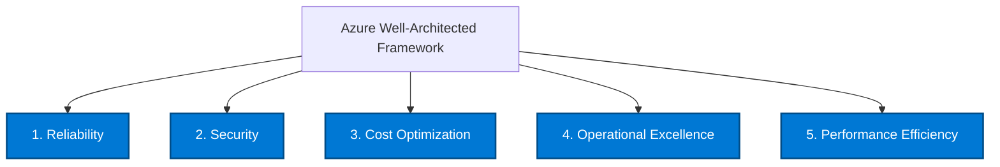

# 🏛️ Azure Well-Architected Framework MOC

> [!abstract] Architectural Excellence on Azure
> The **Microsoft Azure Well-Architected Framework (WAF)** provides guiding tenets and architectural tradeoffs across 5 core pillars to build resilient, secure, and cost-optimized cloud workloads.

---

## 🏛️ The 5 Pillars of Azure Architecture

---

### 1. Reliability
- **Core Goal**: The ability of a system to recover from infrastructure failures and continue to function.
- **Architectural Principles**:
  - **Fault Domains & Update Domains**: Prevent simultaneous node failure within a datacenter.
  - **Availability Zones (AZs)**: Physically separate locations within an Azure region with independent power, cooling, and networking (target: 99.99% VM uptime).
  - **Region Pairs**: Automatic cross-region data replication (e.g. East US $\leftrightarrow$ West US) with coordinated platform updates (never update paired regions simultaneously).
  - **Self-Healing Patterns**: Circuit Breaker, Retry with Exponential Backoff, Compensating Transactions.

### 2. Security
- **Core Goal**: Protecting systems, data, and assets from threats and unauthorized access through defense-in-depth.
- **Architectural Principles**:
  - **Zero Trust Model**: Verify explicitly, use least privileged access, and assume breach.
  - **Identity Perimeter**: Microsoft Entra ID as the primary boundary rather than network firewalls alone.
  - **Data Protection**: Encryption in transit (TLS 1.3), encryption at rest by default via platform keys, customer-managed keys (CMK) in **Azure Key Vault** / **Managed HSM**.
  - **Network Segmentation**: Micro-segmentation with Network Security Groups (NSGs), Application Security Groups (ASGs), and **Private Endpoints**.

### 3. Cost Optimization
- **Core Goal**: Managing costs to maximize the value delivered by cloud resources.
- **Architectural Principles**:
  - **Right-Sizing & Autoscaling**: Eliminate overprovisioning using VM Scale Sets and Serverless models.
  - **Commitment Models**: Azure Reserved Instances (1-yr or 3-yr) and **Azure Savings Plans for Compute** (up to 72% discount).
  - **Azure Hybrid Benefit (AHUB)**: Leverage on-premises Windows Server and SQL Server licenses with Software Assurance to waive compute licensing costs.
  - **Storage Lifecycle Management**: Automatic tiering from Hot $\rightarrow$ Cool $\rightarrow$ Cold $\rightarrow$ Archive.

### 4. Operational Excellence
- **Core Goal**: Operations processes that keep a system running smoothly in production.
- **Architectural Principles**:
  - **Infrastructure as Code (IaC)**: Bicep, Terraform, and Azure Resource Manager (ARM) templates.
  - **Deployment Gates & Rings**: Blue/Green deployments using App Service Deployment Slots; Canary deployments in AKS.
  - **Comprehensive Observability**: Centralize telemetry into **Azure Monitor** and **Log Analytics Workspaces** with automated alerts and Action Groups.

### 5. Performance Efficiency
- **Core Goal**: The ability of a workload to scale efficiently to meet demand changes.
- **Architectural Principles**:
  - **Horizontal vs Vertical Scaling**: Prefer scale-out (VMSS, serverless) over scale-up.
  - **Caching Strategies**: In-memory caching with **Azure Cache for Redis**; edge caching with **Azure Front Door** and **Azure CDN**.
  - **Data Partitioning**: Sharding Cosmos DB via high-cardinality partition keys to prevent hot partitions.

---

> [!tip] Exam Focus (AZ-305)
> Questions frequently present competing requirements (e.g. *"lowest cost with 99.9% SLA"* vs *"zero data loss with multi-region failover"*). Balancing Cost vs Reliability is the most heavily tested pillar trade-off.
