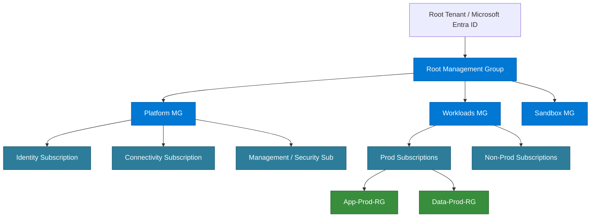

# 🔐 Identity, Governance & Security MOC

> [!abstract] AZ-305 Domain 1 Core
> Covers identity lifecycle, hybrid identity, enterprise governance hierarchies, access control, secrets management, and cloud security posture.

---

## 🏛️ Governance Hierarchy Architecture

---

## 🔑 Core Services & Concepts

### 1. Microsoft Entra ID (formerly Azure Active Directory)
- **Tenants & Directories**: Flat organization boundary.
- **Hybrid Identity Models**:
  - **Password Hash Synchronization (PHS)**: Recommended for most enterprises (easiest, supports leaked credential detection).
  - **Pass-through Authentication (PTA)**: Password validated against on-prem domain controller without storing hashes in cloud.
  - **Federation (AD FS / Ping / Okta)**: Real-time authentication redirect; high operational overhead.
- **Conditional Access**: Zero Trust policy engine evaluating user, device, location, client app, and risk level before granting access.
- **Privileged Identity Management (PIM)**: Just-In-Time (JIT) role activation, time-bound access, approval workflows, MFA enforcement on elevation.

### 2. Azure RBAC vs Azure Policy
| Dimension | Azure RBAC | Azure Policy |
| :--- | :--- | :--- |
| **Purpose** | *Who* can perform actions (*Authentication/Authorization*) | *What* can be created or configured (*Compliance & Guardrails*) |
| **Enforcement** | Grants permissions (User/Group/SPN/Managed Identity) | Blocks non-compliant requests or remediates settings |
| **Example** | Grant User A `Virtual Machine Contributor` on Resource Group B | Deny VM creation outside `eastus` or without tag `CostCenter` |

### 3. Managed Identities for Azure Resources
- **System-Assigned**: Tied directly to the lifecycle of the Azure resource (e.g. VM, Function). Deleted when the resource is deleted.
- **User-Assigned**: Standalone Azure resource lifecycle, can be assigned to multiple VMs or containers.
- **Key Advantage**: Zero credentials in code, automated token rotation via Azure IMDS endpoint (`http://169.254.169.254/metadata/identity/oauth2/token`).

### 4. Secrets & Key Management
- **Azure Key Vault**: Secrets, SSL/TLS certificates, and cryptographic keys (backed by FIPS 140-2 Level 2 validated HSMs).
- **Azure Dedicated / Managed HSM**: Single-tenant, FIPS 140-2 Level 3 validated hardware security modules for strict regulatory compliance.

### 5. Posture & Threat Detection
- **Microsoft Defender for Cloud**: Cloud Security Posture Management (CSPM) and Cloud Workload Protection Platform (CWPP).
- **Microsoft Sentinel**: Cloud-native SIEM and SOAR solution ingesting logs from Entra ID, Azure Activity Log, firewalls, and multi-cloud sources.
