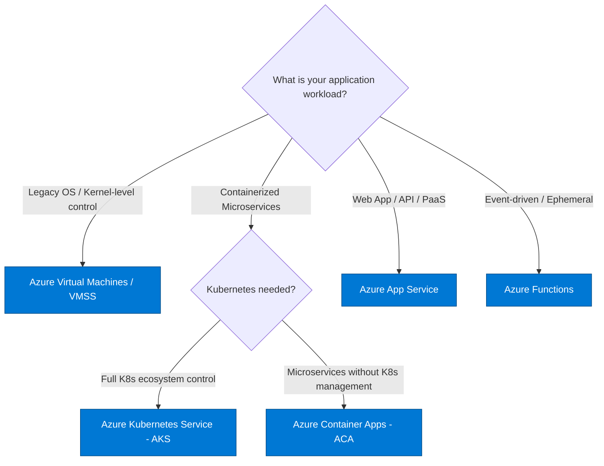

# 💻 Azure Compute & App Services MOC

> [!abstract] AZ-305 Infrastructure Solutions (Compute)
> Covers compute hosting options ranging from Infrastructure as a Service (IaaS VMs & VMSS), Platform as a Service (App Service), Containers (ACA & AKS), and Serverless (Azure Functions).

---

## 🧭 Compute Decision Flowchart

---

## 🖥️ Compute Architecture Breakdown

### 1. Azure Virtual Machines & Scale Sets (VMSS)
- **Virtual Machine Scale Sets (VMSS)**: Auto-scale identical VMs horizontally based on CPU, memory, or custom metrics; supports **Flexible Orchestration Mode** (mix spot and on-demand instances across Availability Zones).
- **Proximity Placement Groups (PPGs)**: Colocates compute resources physically within the same datacenter to achieve sub-millisecond network latency.
- **Spot VMs**: Up to 90% discount for fault-tolerant batch workloads; can be evicted on 30-second notice.

### 2. Azure App Service
- **Hosting Model**: Managed web hosting platform for .NET, Java, Node.js, Python, PHP, or custom containers.
- **Deployment Slots**: Zero-downtime Blue/Green staging and instant traffic swaps (warming up instances prior to swap).
- **Network Integration**:
  - **Inbound**: Private Endpoints or App Service Access Restrictions.
  - **Outbound**: Regional VNet Integration (routes outbound requests into private VNets).
- **App Service Environment (ASE v3)**: Dedicated hardware deployed directly inside customer VNet for high-isolation workloads.

### 3. Container Platforms (ACA vs AKS)
| Feature | Azure Container Apps (ACA) | Azure Kubernetes Service (AKS) |
| :--- | :--- | :--- |
| **Orchestrator** | Managed K8s abstraction (built on Envoy + Dapr + KEDA) | Raw Kubernetes cluster with managed control plane |
| **Control Plane Cost** | Serverless consumption / dedicated workload profile | Free standard cluster tier; paid uptime SLA optional |
| **Scaling** | Scale to zero via KEDA (HTTP, queue, event triggers) | Horizontal Pod Autoscaler (HPA) & Cluster Autoscaler |
| **Best For** | Microservices, event-driven background jobs, simple APIs | Complex enterprise topologies, service meshes, fine-grained K8s CRDs |

### 4. Azure Functions (Serverless)
- **Hosting Plans**:
  - **Consumption Plan**: Dynamic scaling, scale to zero, max 10-minute execution timeout, potential cold start.
  - **Premium Plan**: Pre-warmed instances (no cold start), unlimited execution duration, VNet integration out-of-the-box.
  - **Dedicated (App Service) Plan**: Runs on existing App Service instances; cost-effective if instances are underutilized.
