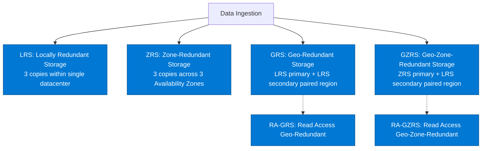

# 🗄️ Azure Storage & Data Services MOC

> [!abstract] AZ-305 Domain 2 Core
> Architectural patterns and service selection for object storage, fileshares, relational databases, distributed NoSQL, and analytical data stores on Azure.

---

## 🧭 Storage Redundancy Hierarchy



---

## 📦 Object & File Storage Solutions

### 1. Azure Blob Storage
- **Access Tiers**:
  - **Hot**: Actively accessed, lowest access cost, higher storage cost.
  - **Cool**: Accessed infrequently (min 30-day retention), lower storage cost, higher access fee.
  - **Cold**: Rarely accessed (min 90-day retention), intermediate tier between Cool and Archive.
  - **Archive**: Offline archival (min 180-day retention), lowest storage cost, hours retrieval latency (Standard vs High Priority rehydration).
- **Blob Lifecycle Management**: Automatic policy-driven tiering and expiration based on prefix and last modified/accessed date.
- **Azure Data Lake Storage Gen2 (ADLS Gen2)**: Blob storage with Hierarchical Namespace (HNS) enabled, POSIX-compliant ACLs for big data analytics (Synapse, Databricks).

### 2. Azure Files & Azure NetApp Files
- **Azure Files**: Fully managed SMB (2.1/3.0) and NFS 4.1 file shares mounted by Windows, Linux, and macOS; integrated with **Azure File Sync** for on-premises branch office caching.
- **Azure NetApp Files (ANF)**: Enterprise-grade bare-metal NetApp flash storage for ultra-low latency, sub-millisecond high-IOPS enterprise databases (SAP HANA, high-performance computing).

---

## 🗃️ Database Architectures

### 1. Azure SQL Ecosystem
| Model | Deployment Characteristics | Best For |
| :--- | :--- | :--- |
| **Azure SQL Database (Single/Elastic)** | Fully managed DBaaS; serverless or provisioned vCore; 99.995% SLA; automatic tuning. | Modern cloud-native apps, multi-tenant SaaS with Elastic Pools. |
| **Azure SQL Managed Instance (MI)** | 99% compatibility with SQL Server on-prem; native VNet injection; SQL Agent, Cross-database queries, CLR. | Lift-and-shift modernization of legacy enterprise SQL Server applications. |
| **SQL Server on Azure VMs** | Full OS and DBMS administrative control; manual patching, backups, and HA configuration. | Legacy versions (SQL 2012/2014), OS-level third-party agents. |
| **Hyperscale Tier** | Decoupled compute and storage; instant scaling up to 100 TB; rapid snapshot-based restores. | Massive databases with volatile query load and multi-terabyte growth. |

### 2. Azure Cosmos DB (Distributed NoSQL)
- **Multi-Model APIs**: Core (SQL), MongoDB, Cassandra, Gremlin, Table.
- **Multi-Region Replication**: Active-Active multi-region writes with guaranteed $<10\text{ ms}$ read/write latencies.
- **5 Consistency Levels**:
  ```mermaid
  graph LR
      Strong[Strong] --> Bounded[Bounded Staleness]
      Bounded --> Session[Session: Default]
      Session --> Consistent[Consistent Prefix]
      Consistent --> Eventual[Eventual]
  ```
  1. **Strong**: Linearizability, zero RPO, highest latency, restricted to single-region writes.
  2. **Bounded Staleness**: Reads lag behind writes by at most $K$ versions or $T$ time. Ideal for globally distributed systems needing strict staleness guarantees.
  3. **Session (Default)**: Consistent prefix, monotonic reads/writes, read-your-writes guarantee for client session.
  4. **Consistent Prefix**: Updates never seen out of order; no lag guarantees.
  5. **Eventual**: Lowest latency, weakest consistency, eventual convergence.
