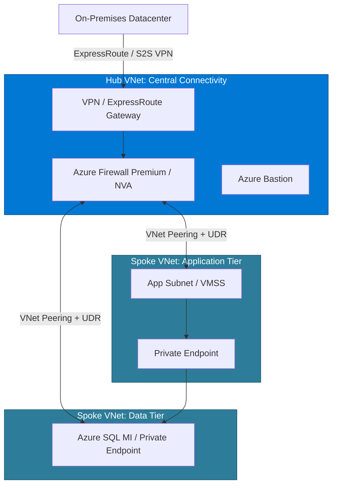

# 🌐 Azure Networking & Hybrid Connectivity MOC

> [!abstract] AZ-305 Infrastructure Solutions (Networking)
> Enterprise network topologies, routing policies, traffic inspection, edge acceleration, and hybrid interconnectivity between on-premises datacenters and Azure.

---

## 🏛️ Enterprise Hub-and-Spoke Topology

---

## 🚦 Load Balancing & Traffic Routing Comparison

| Service | OSI Layer | Scope | Key Differentiator | Best For |
| :--- | :--- | :--- | :--- | :--- |
| **Azure Load Balancer** | Layer 4 (TCP/UDP) | Regional | Ultra-low latency, millions of flows/sec, health probes | Internal tier balancing, VM egress SNAT |
| **Application Gateway** | Layer 7 (HTTP/HTTPS) | Regional | Cookie-based affinity, SSL termination, integrated **WAF v2** | Regional web applications, URL path-based routing |
| **Azure Front Door** | Layer 7 (HTTP/HTTPS) | Global | Global Anycast network, edge SSL offload, CDN caching, global WAF | Global multi-region web applications, instant regional failover |
| **Azure Traffic Manager** | DNS-based | Global | DNS name resolution redirection (Performance, Weighted, Priority) | Non-HTTP protocols, legacy multi-region failover |

---

## 🔒 Network Security & Zero Trust

### 1. Network Security Groups (NSGs) & Application Security Groups (ASGs)
- **NSGs**: Statefull packet filtering rules (5-tuple: source IP, source port, dest IP, dest port, protocol) evaluated by priority (100 to 4096).
- **ASGs**: Logical grouping of VMs allowing security policies based on application roles rather than static IP addresses.

### 2. User-Defined Routes (UDRs) & Azure Firewall
- Default Azure routing forwards traffic directly between peered VNets.
- **UDR with `0.0.0.0/0` next-hop to Virtual Appliance**: Forces all north-south and east-west traffic through **Azure Firewall** for stateful inspection, TLS inspection, and threat intelligence.

### 3. Private Link & Private Endpoints
- Brings PaaS services (Blob, SQL, Key Vault, Cosmos DB) inside your private VNet using a private IP address (`nic`).
- Completely disables exposure to public internet endpoints and prevents data exfiltration.

---

## ⚡ Hybrid Connectivity: VPN vs ExpressRoute
- **Site-to-Site (S2S) VPN**: IPsec VPN tunnel over public internet; up to $1.25\text{ Gbps}$ per tunnel; cost-effective, encrypted by default.
- **Azure ExpressRoute**: Dedicated private Layer 2/3 connection through connectivity provider; does not traverse public internet; speeds up to $100\text{ Gbps}$; predictable low latency, BGP routing, supports **Private Peering** (VNets) and **Microsoft Peering** (M365, public PaaS).
