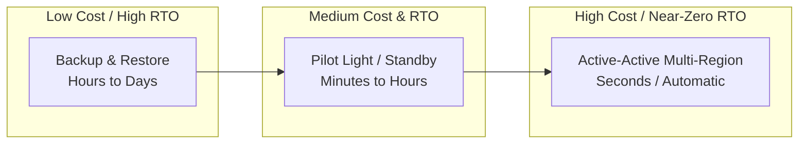
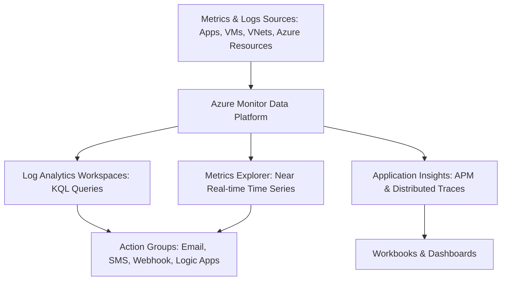

# 🛡️ Azure Business Continuity, Monitoring & Migration MOC

> [!abstract] AZ-305 Domain 3 Core
> Disaster recovery design, backup policies, full-stack observability with Azure Monitor, and enterprise migration strategies using Azure Migrate.

---

## 🔁 BCDR Spectrum: RTO vs RPO

---

## 🛡️ Business Continuity & Disaster Recovery (BCDR)

### 1. Azure Site Recovery (ASR)
- **Architecture**: Orchestrates replication, failover, and recovery of Azure VMs, on-premises VMware/Hyper-V, and physical servers to secondary Azure regions.
- **Replication Flow**: Near-continuous asynchronous block replication to cache storage account $\rightarrow$ replicated target managed disks.
- **Failover Types**:
  - **Test Failover**: Spins up VMs in an isolated non-production VNet with zero interruption to ongoing replication or production workloads.
  - **Planned Failover**: Flushes latest changes before failover (zero data loss).
  - **Unplanned Failover**: Immediate failover to latest recovery point (RPO typically $<15\text{ minutes}$).

### 2. Azure Backup
- **Recovery Services Vault vs Backup Vault**: Centralized management of backup policies, access control, and restore points.
- **Immutability & Multi-User Authorization (MUA)**: Protects backups from deletion by compromised administrator credentials using resource guards and immutable vault locks.
- **Cross-Region Restore (CRR)**: Allows restore in paired secondary region even when primary region is fully intact or experiencing an outage.

---

## 📊 Observability with Azure Monitor

- **Application Insights**: Application Performance Monitoring (APM) for live web apps, telemetry correlation, exception tracking, dependency maps.
- **Log Analytics Workspaces**: Scalable repository queried via **Kusto Query Language (KQL)** for diagnostics, security auditing, and cross-resource log joining.
- **Action Groups**: Reusable notification and automation channels triggered by alert rules (PagerDuty, SMS, Webhook, Automation Runbook, Azure Function).

---

## 🚚 Enterprise Migration with Azure Migrate
- **Phase 1: Discovery & Assessment**: Agentless discovery of on-premises VMs, inventorying software, mapping network dependencies, and right-sizing recommendations.
- **Phase 2: Business Case & TCO**: Calculating projected savings with Azure Hybrid Benefit and Reserved Instances.
- **Phase 3: Migration Execution**:
  - **Azure Migrate: Server Migration**: Agentless replication of VMware VMs / Hyper-V; minimal downtime cutover.
  - **Azure Database Migration Service (DMS)**: Online (minimal downtime) or offline migration of on-prem SQL Server, Oracle, and MySQL to Azure SQL / PostgreSQL.
  - **Data Box Family**: Offline physical data transfer devices ($8\text{ TB}$ to $1\text{ PB}$) for bandwidth-constrained data migrations.
